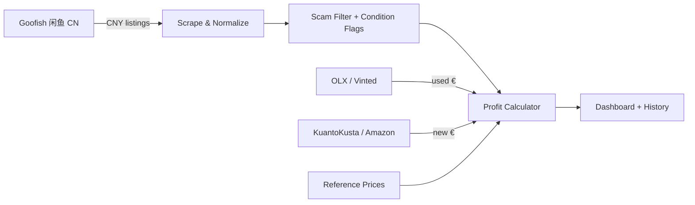

# ⚡ Arbitrage Intelligence — Cross-Border Electronics Arbitrage Engine

> **Find used Chinese electronics on Goofish (闲鱼) that you can buy in CNY, ship to
> Portugal, and resell on EU marketplaces for a real profit — after every hidden fee.**

A full-stack price-arbitrage scanner that scrapes **Goofish (China, ¥)** listings and
matches them against **EU resale prices** (OLX.pt, Vinted.pt, KuantoKusta.pt, Amazon.es — €)
to compute **net profit after the entire Portugal import cost stack**: FX conversion,
buying-agent fees, air freight, customs clearance, import duty, VAT, and domestic
shipping.

---

## 📋 Badges


---

## 📑 Table of Contents

- [🚀 Features](#-features)
- [🧠 How It Works](#-how-it-works)
- [🏗️ Architecture](#️-architecture)
- [🛠️ Setup & Installation](#️-setup--installation)
- [⚙️ Configuration / Environment Variables](#️-configuration--environment-variables)
- [📸 Screenshots](#-screenshots)
- [🔧 Development Guide](#-development-guide)
- [🧪 Testing & Linting](#-testing--linting)
- [🤝 Contributing](#-contributing)
- [📄 License](#-license)

---

## 🚀 Features

- **🇨🇳 Goofish live scraper** — real Playwright browser session that dismisses login
  modals, survives the Baxia anti-bot wall (UA rotation + surgical overlay removal),
  lazy-loads all listings per page, and clicks through pagination.
- **🇵🇹🇪🇸 4 EU marketplaces** — OLX.pt + Vinted.pt (second-hand) and KuantoKusta.pt +
  Amazon.es (new retail), with HTTP-fetch-first and Playwright fallback strategies.
- **🛡️ 4-layer scam filter** — blacklist auto-drop, risk scoring, negation-aware
  Chinese token detection, and junk-listing filtering (boxes, rentals, unlock scams).
- **🔍 Generation-aware relevance matching** — searching "iPhone 17" never returns an
  iPhone 13/14/15/16; a window-based Chinese/English verb engine (换屏 / 屏幕换过 /
  "screen replaced") with negation scoping.
- **💸 Full landed-cost model** — CNY→EUR FX, exchange fee, agent service fee
  (CSS Buy / Superbuy / Wegobuy / Bhiner presets), inspection, CN domestic shipping,
  insurance, air freight, customs broker, import duty, PT VAT, and CTT domestic
  shipping — with Conversion Only / Realistic / Conservative / Deep Scan presets.
- **🧮 Profit analysis** — resale estimate from reference prices, platform fees,
  min-margin & min-profit gates, per-listing profit/margin breakdown.
- **📊 Analytics dashboard** — profit charts, trend tracking across scans, heatmaps by
  product family × condition, summary cards with click-to-filter.
- **🗂️ Persistent history** — SQLite-backed scan history with live progress, logs,
  manual-paste recovery, re-run, delete & clear-all.
- **🌐 PT/EN translation** — one-click LLM translation of Chinese listings.
- **📦 CSV / JSON export** — decision-critical fields (lock status, region version,
  seller rating, condition flags, direct listing URLs).

---

## 🧠 How It Works



1. **Scrape** — all five platforms run concurrently (Playwright + HTTP fallbacks).
2. **Normalize** — product family / model / storage / condition are parsed from raw
   Chinese titles.
3. **Filter** — scam detection, junk removal, generation-relevance, accessory removal.
4. **Match** — each Goofish listing is matched to EU comps of the same family + tier.
5. **Calculate** — landed cost in EUR vs. expected EU resale → **net profit & margin**.
6. **Present** — sortable table, charts, history, CSV/JSON export.

---

## 🏗️ Architecture

```
arbitrage-tool/
├── prisma/
│   └── schema.prisma          # SQLite schema (Task, ReferencePrice)
├── public/
│   └── logo.svg               # Static assets
├── src/
│   ├── app/
│   │   ├── api/               # Next.js route handlers
│   │   │   ├── tasks/         # submit, status, result, cancel, list, …
│   │   │   ├── config/        # config + reference-prices API
│   │   │   ├── debug/         # per-scraper diagnostics (screenshots)
│   │   │   └── translate/     # LLM listing translation
│   │   └── page.tsx           # Main dashboard
│   ├── components/
│   │   ├── arbitrage/         # Dashboard UI (results, charts, history, …)
│   │   └── ui/                # shadcn/ui primitives
│   ├── hooks/                 # Keyboard shortcuts, saved queries
│   ├── lib/
│   │   ├── engine/            # Normalizer, matcher, scam detector,
│   │   │                      # condition flags, profit calc, forex
│   │   ├── scrapers/          # goofish, olx, vinted, kuantokusta, amazon
│   │   ├── orchestrator.ts    # Pipeline state machine + task store glue
│   │   ├── task-store.ts      # In-memory + SQLite persistence
│   │   └── reference-prices.ts# DB-backed price matrix
│   └── config.json            # Default runtime config (FX, fees, pages…)
├── db/custom.db               # SQLite database (created at first run)
├── Caddyfile                  # (Optional) reverse-proxy example
└── package.json
```

**Key decisions**

- **Next.js 16 (App Router) + React 19** — single repo for UI + API routes.
- **Prisma + SQLite** — zero-setup persistence that survives dev-server restarts
  (`db/custom.db`, ACID writes).
- **Playwright** — real-browser scraping with stealth fingerprints (Windows UA,
  client hints, service-worker neutralization).
- **shadcn/ui + Tailwind 4** — fast, themeable dashboard.
- **Recharts** — profit/trend visualizations.

---

## 🛠️ Setup & Installation

> ⚠️ **Requirements:** Node.js ≥ 20, `bun` or `npm`, and Playwright Chromium
> (`npx playwright install chromium`).

```bash
# 1. Clone the repository
git clone https://github.com/you/arbitrage-tool.git
cd arbitrage-tool

# 2. Install dependencies
bun install          # or: npm install

# 3. Configure environment
cp .env.example .env # then edit values (see below)

# 4. Prepare the database (creates db/custom.db)
bunx prisma generate
bunx prisma db push

# 5. Install the Playwright browser (required for live scraping)
npx playwright install chromium

# 6. Run the development server
bun run dev          # → http://localhost:3000
```

### 🚀 Production build (standalone)

```bash
bun run build        # next build + standalone bundle (browsers, db, .env)
bun run start        # NODE_ENV=production bun .next/standalone/server.js
```

---

## ⚙️ Configuration / Environment Variables

| Variable | Description | Example |
|---|---|---|
| `DATABASE_URL` | SQLite connection string | `file:./db/custom.db` |
| `SKIP_LIVE_FETCH` | Bypass real scraping (use mock/demo data) | `1` or `0` |
| `NODE_OPTIONS` | Node runtime flags | `--max-old-space-size=4096` |
| `LLM_API_KEY` *(optional)* | Provider key for the translate endpoint | `sk-…` |
| `LLM_BASE_URL` *(optional)* | Provider base URL for the translate endpoint | `https://api.example.com/v1` |

**Runtime config** lives in `src/config.json`:

- 🌐 `forex` — CNY→EUR rate, exchange fee, API fallback.
- 🚚 `logistics` — agent fees, inspection, CN/PT shipping, insurance, intl freight,
  customs, import duty.
- 🧾 `tax`, `profitability`, `scam_filter` — VAT, min margin/profit, scam threshold.
- 🔍 `scraping` — max pages per site, jitter window, per-site URLs, skip toggles.

All of these are overridable live from the **Configuration Overrides** panel
(with server-side validation & clamping on the submit API).

---

## 📸 Screenshots


---

## 🔧 Development Guide

### Useful commands

| Command | Purpose |
|---|---|
| `bun run dev` | Start dev server on :3000 |
| `bun run lint` | ESLint over the whole repo |
| `bun run build` | Production standalone build |
| `bun run start` | Run the standalone server |
| `bunx prisma studio` | Browse the SQLite DB visually |
| `bun run db:reset` | Wipe + recreate the DB schema |

### Commit conventions

- Use conventional prefixes: `fix:`, `feat:`, `chore:`, `docs:`, `refactor:`.
- Keep commits atomic — one logical change each.
- Run `bun run lint` before committing.

### Debugging scrapers

The dashboard's **Debug Scrapers** panel runs each scraper with full diagnostics and
saves screenshots to `db/debug-screenshots/`. Alternatively hit the endpoints
directly:

```bash
curl "http://localhost:3000/api/debug/goofish?query=iPhone%2017"
curl "http://localhost:3000/api/debug/amazon?query=iPhone%2017%20Pro%20Max"
```

---

## 🧪 Testing & Linting

```bash
bun run lint              # ESLint
npx tsc --noEmit          # Type-check (next build also runs this)
```

The condition-flag engine (`src/lib/engine/condition-flags.ts`) is validated
against a 278-case suite covering Chinese + English listing phrases — negation
scoping ("屏幕没换过电池换过"), accessory traps ("换过钢化膜"), warranty clauses
("人为损坏/进水/不在保修范围内"), and every word order of repair verbs. The
same suite is used to guard future changes to the engine.

---

## 🤝 Contributing

1. 🍴 Fork the repo and create a feature branch (`git checkout -b feat/xyz`).
2. ✍️ Write code + keep the lint/type checks green.
3. 🧪 Add test cases for any condition-flag / scraper change.
4. 📬 Open a pull request with a clear description.

---

## 📄 License

**Private / All Rights Reserved.** This project is not licensed for public
redistribution. Contact the maintainer for permission inquiries.

---

<p align="center">Built with ❤️ for cross-border electronics arbitrage — Goofish → Portugal.</p>
